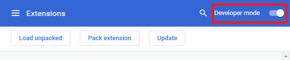

Test user agent Chrome extension
=================

## Disclaimer

The current User Agent extension is an experimental prototype, and is currently sideloaded onto Google Chrome. This extension should not be used for production services; any interface exposed may change at any time. Do not use this extension to secure any real data or assets. Over time we plan to provide production-ready user agent applications across platforms including mobile and desktop.

## Installation

1. Download the [current build](/dist/example-user-agent.zip) of the prototype extension.
2. Unzip the file to produce a folder called `example-user-agent`.
3. Open Google Chrome.
4. Go to [chrome://extensions/](chrome://extensions/)
5. Enable "Developer mode" on the top left. 
    
6. Click the "Load unpacked" button.
    
7. Choose the extracted folder `example-user-agent` and load the extension into Chrome.
